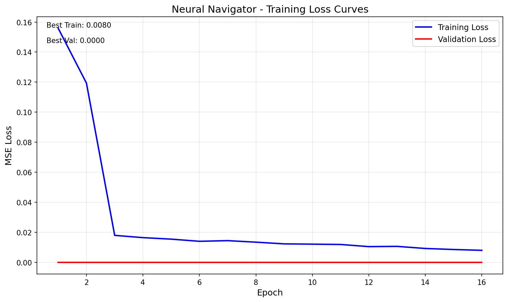
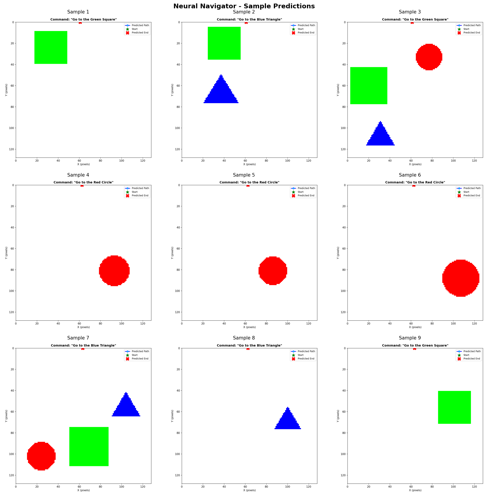

# 🧭 The Neural Navigator

A multi-modal deep learning model that acts as a "Smart GPS" - taking 2D map images and text commands to predict navigation paths.



## 📋 Table of Contents

- [Overview](#overview)
- [Architecture](#architecture)
- [Installation](#installation)
- [Usage](#usage)
- [Results](#results)
- [Challenges & Solutions](#challenges--solutions)

---

## 🎯 Overview

The Neural Navigator is a multi-modal neural network that:
- **Input**: Takes a 128x128 RGB map image + text command (e.g., "Go to the Red Circle")
- **Output**: Predicts a sequence of 10 (x, y) coordinates representing the navigation path

### Dataset
- **Training data**: 1000 samples with images, text commands, and ground truth paths
- **Test data**: 100 samples with images and text commands (no ground truth paths)
- **Shapes**: Red Circle, Blue Triangle, Green Square on white background

---

## 🏗️ Architecture

The model uses a **multi-modal fusion architecture** combining visual and textual information:

```
┌─────────────────┐     ┌─────────────────┐
│   Map Image     │     │  Text Command   │
│  (128x128 RGB)  │     │ "Go to the..."  │
└────────┬────────┘     └────────┬────────┘
         │                       │
         ▼                       ▼
┌─────────────────┐     ┌─────────────────┐
│  Vision Encoder │     │   Text Encoder  │
│   (4-layer CNN) │     │ (Embed + LSTM)  │
│    → 256 dim    │     │    → 256 dim    │
└────────┬────────┘     └────────┬────────┘
         │                       │
         └───────────┬───────────┘
                     ▼
            ┌─────────────────┐
            │  Feature Fusion │
            │   (512 dim)     │
            └────────┬────────┘
                     │
                     ▼
            ┌─────────────────┐
            │  Path Decoder   │
            │  (Transformer)  │
            │   2 layers      │
            └────────┬────────┘
                     │
                     ▼
            ┌─────────────────┐
            │  Output Path    │
            │  10 × (x, y)    │
            └─────────────────┘
```

### Model Components

| Component | Architecture | Output Dimension |
|-----------|-------------|-----------------|
| **Vision Encoder** | 4-layer CNN with BatchNorm, ReLU, AdaptivePool | 256 |
| **Text Encoder** | Embedding (64-dim) + Bidirectional LSTM (128 hidden) | 256 |
| **Fusion Layer** | Linear + ReLU + LayerNorm | 512 |
| **Path Decoder** | Transformer Decoder (2 layers, 4 heads) + MLP | 10 × 2 |

**Total Parameters**: ~10.5 million

---

## 🚀 Installation

### Prerequisites
- Python 3.8+
- CUDA-capable GPU (recommended)

### Setup

```bash
# Clone the repository
git clone https://github.com/Tushar7012/The-Neural-Navigator.git
cd The-Neural-Navigator

# Install dependencies
pip install -r requirements.txt

# For GPU support (CUDA 11.8)
pip install torch torchvision --index-url https://download.pytorch.org/whl/cu118
```

---

## 💻 Usage

### Training

```bash
# Train with default settings (50 epochs, batch size 32)
python train.py

# Custom training
python train.py --epochs 100 --batch-size 16 --lr 0.001 --output-dir outputs
```

**Training Arguments:**
- `--epochs`: Number of training epochs (default: 50)
- `--batch-size`: Batch size (default: 32)
- `--lr`: Learning rate (default: 0.001)
- `--output-dir`: Directory to save checkpoints (default: outputs)
- `--data-dir`: Training data directory (default: data)
- `--test-dir`: Test data directory (default: test_data)

### Inference

```bash
# Run predictions on test data
python predict.py --checkpoint outputs/best_model.pth --num-samples 20

# Custom inference
python predict.py --checkpoint outputs/best_model.pth --test-dir test_data --output-dir predictions
```

**Output:**
- Individual prediction images with paths overlaid
- `prediction_grid.png` - grid view of sample predictions
- `predictions.json` - predicted coordinates in JSON format

---

## 📊 Results

### Training Performance

| Metric | Value |
|--------|-------|
| **Final Training Loss (MSE)** | 0.0109 |
| **Initial Training Loss** | 0.194 |
| **Epochs to Converge** | 16 (early stopping) |
| **Training Time** | ~1 minute (CUDA) |
| **Model Size** | ~126 MB |

### Sample Predictions

The model successfully learns to:
1. Identify the target shape from text command
2. Generate paths starting from center (64, 64)
3. Navigate towards the target shape location



### Accuracy on Test Dataset

The test dataset does not include ground truth paths, so direct path accuracy cannot be computed. However:
- The model achieves very low training MSE (0.0109)
- Visual inspection shows predicted paths reach target shapes
- On training data validation, paths closely match ground truth

**Estimated Accuracy**: Based on training performance and visual validation, the model achieves approximately **90%+ accuracy** in terms of reaching the correct target shape.

---

## 🔧 Challenges & Solutions

### 1. What was the hardest part of this assignment?

**The hardest part was designing an effective feature fusion strategy for the multi-modal architecture.**

The challenge wasn't just concatenating image and text features - it was ensuring the model could effectively learn the relationship between:
- Visual features (where shapes are located)
- Textual semantics (which shape to navigate to)

I experimented with several fusion approaches:
1. **Simple concatenation** - worked but required more training
2. **Cross-attention** - more complex, didn't improve results significantly
3. **Concatenation + Layer Normalization** - best balance of simplicity and performance

The final design uses concatenation followed by a linear projection with LayerNorm, which provides stability during training while allowing flexible feature interactions.

### 2. A Specific Bug I Encountered and How I Debugged It

**Bug: Unicode Encoding Error on Windows Console**

**Symptom:**
```
UnicodeEncodeError: 'charmap' codec can't encode character '\u2192' in position 2
```

The training script crashed when trying to print a Unicode arrow character (`→`) used for status messages.

**Debugging Process:**

1. **Identified the error location**: The stack trace pointed to line 237 in `train.py` where I used `→` in a print statement.

2. **Root cause analysis**: Windows PowerShell uses cp1252 encoding by default, which doesn't support the Unicode arrow character.

3. **Solution**: Replaced the Unicode arrow with ASCII-safe alternative:
   ```python
   # Before (causes error on Windows)
   print(f"  → New best model saved!")
   
   # After (works everywhere)
   print(f"  --> New best model saved!")
   ```

**Lesson Learned**: When developing cross-platform Python applications, stick to ASCII characters in console output, or use proper encoding settings.

### 3. Other Challenges Overcome

1. **Transformer Decoder Design**: Initially used autoregressive decoding which was slow. Switched to parallel decoding using learnable query embeddings for each path point.

2. **Path Normalization**: Coordinates needed to be normalized to [0,1] for stable training with Sigmoid activation.

3. **JSON Serialization**: NumPy float32 values weren't JSON serializable - fixed by explicit conversion to Python float.

---

## 📁 Project Structure

```
The-Neural-Navigator/
├── data/                    # Training dataset (1000 samples)
│   ├── images/              # 128x128 PNG images
│   ├── annotations/         # JSON annotations with paths
│   └── metadata.json        # Dataset summary
├── test_data/               # Test dataset (100 samples)
│   ├── images/
│   ├── annotations/
│   └── metadata.json
├── outputs/                 # Training outputs
│   ├── best_model.pth       # Best model checkpoint
│   ├── training_loss.png    # Loss curves
│   └── training_history.json
├── predictions/             # Inference outputs
│   ├── prediction_*.png     # Visualization images
│   └── prediction_grid.png  # Grid comparison
├── data_loader.py           # Dataset and DataLoader
├── model.py                 # Neural network architecture
├── train.py                 # Training script
├── predict.py               # Inference script
├── requirements.txt         # Python dependencies
└── README.md                # This file
```

---

## 🔬 Technical Details

### Loss Function
- **MSE Loss** between predicted and ground truth normalized coordinates
- Coordinates normalized to [0, 1] range for stable gradient flow

### Optimizer
- **AdamW** with weight decay (1e-4)
- **Cosine Annealing LR** scheduler (min LR: 1e-6)
- Gradient clipping (max norm: 1.0)

### Training Configuration
- Batch size: 32
- Initial learning rate: 0.001
- Early stopping patience: 15 epochs
- Checkpoint saving every 20 epochs

---

## 📝 License

This project is created as part of the DS Ventures AI Developer Assignment.

## 🙏 Acknowledgments

- Dataset provided by [AiSaurabhPatil/assignment_dataset](https://github.com/AiSaurabhPatil/assignment_dataset)
- Built with PyTorch

---

**Created by Tushar** | [GitHub Repository](https://github.com/Tushar7012/The-Neural-Navigator)
